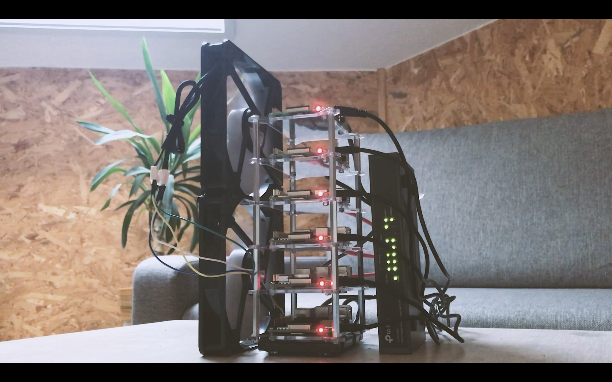

# High availability K8S cluster on raspberry pi
Created by [Karol Szymanowski](https://www.linkedin.com/in/karol-sz/)

Presentation in which I explain how I built a high-availability kubernetes cluster using several raspberry pi computers.
The length of the full presentation is planned for 1.5 hours.

The presentation explains:
- What components are needed to build a cluster.
- How to automate the process of configuring raspberry pi and installing k8s using [ansible](https://www.ansible.com/).
- The principles of high cluster availability and various disaster scenarios, as well as the way k8s handles them.
- How authorization/authentication/rbac works in k8s and how to configure OIDC [dex](https://github.com/dexidp/dex) so that the user can log in via github (or any other provider) and receive the appropriate roles depending on which team he is assigned to.
- How to manage a kubernetes using tools such as: [k9s](https://github.com/derailed/k9s), [weavescope](https://github.com/weaveworks/scope), kubectl, kubernetes dashboard
- How to monitor the cluster and services using [prometheus](https://prometheus.io/), [alert-manager](https://prometheus.io/docs/alerting/latest/alertmanager/), [grafana](https://grafana.com/) and [linkerd](https://linkerd.io/2/overview/)
- How the entire flow of software development looks from the developer perspective with kubernetes (short coding demo).

#### Goals

The main purpose of the presentation is to present the possibilities of kubernetes
and the benefits that its implementation can bring to the organization.
